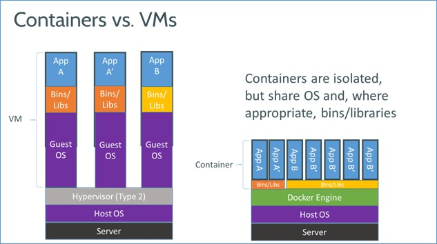

# Docker - Sommaire

---

# Introduction
## Qu'est ce que Docker ?
[Docker](https://www.docker.com) est un service permettant de simplifier la _conteneurisation_.

Docker est un logiciel qui permet de créer des _images_ système, qui serons ensuite utiliser pour créer des _conteneurs_. Plusieurs _conteneurs_ peuvent tourner en même temps, en utilisant la même _image_.

## Conteneurisa... Quoi ?
La _conteneurisation_ est une technologie permettant de pouvoir créer un système dans un environnement restreint.
Ainsi, il est séparé du système hôte. De fait, les _images_ docker peuvent très bien ne pas être basé sur le même type de système que celui de l'hôte.

De manière imagé, on peux dire que la _conteneurisation_ pernet de créer "une boite" contenant un serveur indépendant à l'intérieur d'un serveur.

## ... Mais encore?
Pouvoir _conteneuriser_ les services est une fonctionnalitée très puissante, et ce sur plusieurs aspects:
* Puisque le système est indépendant, il peut être déployer simplement sur de nombreux hôtes.
* Il est facile de pouvoir améliorer les performances, nottament en éxecutant plusieurs conteneurs pour le même service.
* Avec Docker, nous ne sommes plus esclaves des dépendances

## Mais ... C'est pas de la virtualisation ton truc ?
Dans le fond, l'idée de la _conteneurisation_ et de la _virtualisation_ se rejoignent: Offrir à l'utilisateur le moyen de démarrer un ou plusieurs système différents du système hôte.

Cependant, la ou la _conteneursation_ se démarque de la _virtualisation_, c'est dans sa conception.

Voici comment nous pourrions représenter physiquement  le fonctionnement de ces 2 technologies:

Source : Docker.io

Ce qu'il faut retenir, c'est que la _conteneurisation_ utilise les fonctionnalitées de base du système hôte, ce qui permet d'éviter de dupliquer les fonctionnalitées coeur des systèmes.

En terme simple: Un _conteneur_ est beaucoup plus léger qu'une _machine virtuelle_. Un _conteneur_ pèse environ 300Mo alors qu'une _machine virtuelle_ vas plutôt peser 1Go.

## C'est quoi le problème?
Il n'y a pas vraiment de problème connu à cette technologie.

La vraie problèmatique réside dans le fait que nous devons changer notre façons de faire pour s'adapter à cette technologie.

Car pour utiliser docker, il faut se remémorer plusieurs point:
* Un _conteneur_ est par définition èphémère. Il faut donc bien configurer son images pour exporter les données que nous souhaitons garder
* Il est préfèrable de séparer autant que possible les services, afin de pouvoir améliorer facilement les services si il y à besoin de rajouter plus de _conteneurs_.
* Lorsque Docker lance un _conteneur_, le _conteneur_ doit exècuter une commande, puis se stoper.  Il faut donc en tenir compte lors de la conception.

# Comment ça marche ?
## Installation de docker
Tout d'abord, pour pouvoir utiliser Docker, il faut l'installer. Pour pouvoir fonctionner, Docker nécessite un firmware récent. Nous n'allons pas détailler dans ce document l'installation de docker. Au besoin, voici la page de documentation officiel de docker pour [l'installation](https://store.docker.com/editions/community/docker-ce-server-ubuntu)

##  La théorie
Voici comment docker procède lorsque vous lui demander d'éxecuter un _conteneur_:
* Docker recherche dans son cache si il possède déjà l'_image_ que vous demandez.
  * Si l'_image_ demandée n'existe pas, docker télécharge alors l'_image_ de base depuis le [dockerhub](https://hub.docker.com/).
* Docker créé ensuite un _conteneur_ avec l_'image_ demandée..
* Une fois le _conteneur_ crée, il éxecute la commande définie comme point d'entrée.
* Une fois la commande éxecutée, Docker stop le _conteneur_.

### Et si je le relance?
Peut-être vous demandez vous pourquoi nous devons sortir les données hors du _conteneur_. Effectivement, si le conteneur est stopé une fois qu'il s'est executé, si nous le relançons, nous devrions pouvoir retrouver les données dedans.

Oui et non.

Si vous relancez la même commande que celle utilisée pour la création du premier _conteneur_, Docker créera un nouveau _conteneur_ en se basant sur l'image. Il sera donc différents du conteneurs sur lequel vous aviez vos données.

Cepedant, il est possible de relancer un _conteneur_ spécifique., mais ce n'est pas dans la philosophie de Docker.
Repartir d'une image vierge pour refaire votre _conteneur_ permet de vous assurer que vous pourrez redéployer façilement votre logiciel, ou le faire évoluer simplement.

## La pratique
Il existe 3 moyens de lancer un docker:

### docker run
C'est la manière la plus simple, mais la moins permissive.
Cela permet de lancer un conteneur déjà présent sur le dockerhub.

Exemple:

```docker run hello-world ```

Cette commande vas lancer un conteneurs en ce basant sur l'image ```hello-world```

Il est possible, via cette ligne de commande, de rajouter plusieurs options utile, comme de se connecter via un interpreteur de commande, de définir que le dossier ```mes-donnees``` du _conteneur_ doit être exporté dans un dossier ```donnees-docker ``` sur le serveur hôte,  ou encore de faire comprendre au serveur que le port 8090 du serveur hôte doit être redirigé vers le port 80 du _conteneur_.

Exemple 2:

```docker run ubutu -p 8090:80 -v donees-docker:/home/user/mes-donnees -it bash```

### Dockerfile
**W**ork **I**n **P*rogress

### Docker-compose
**W**ork **I**n **P*rogress

# Les dockers de FREYJA
## Informations
Nous ne traiterons pas dans cette documentation l'implementation des différents docker utilisé pour faire fonctionner Freyja.

Pour avoir plus d'informations, rendez vous sur la page [github](https://github.com/lexteamexecutive/freyja-docker)

## Récupérer les Docker
**N**.**B**: Cette section est réservée aux personnes compétentes.

Pour pouvoir récuperer les dockers, il faut cloner le repo, configurer le fichier ```.env``` en vous inspirant du fichier ```env.dist``` disponnible sur le repo:
```bash
git clone https://github.com/lexteamexecutive/freyja-docker
cd freyja-docker
docker-compose build
docker-compose up -d --force-recreate
#Pour stopper les docker-compose
docker-compose down
```
---
Retour sur la [page d'acceuil](http://docs.lexteam-executive.com/)
